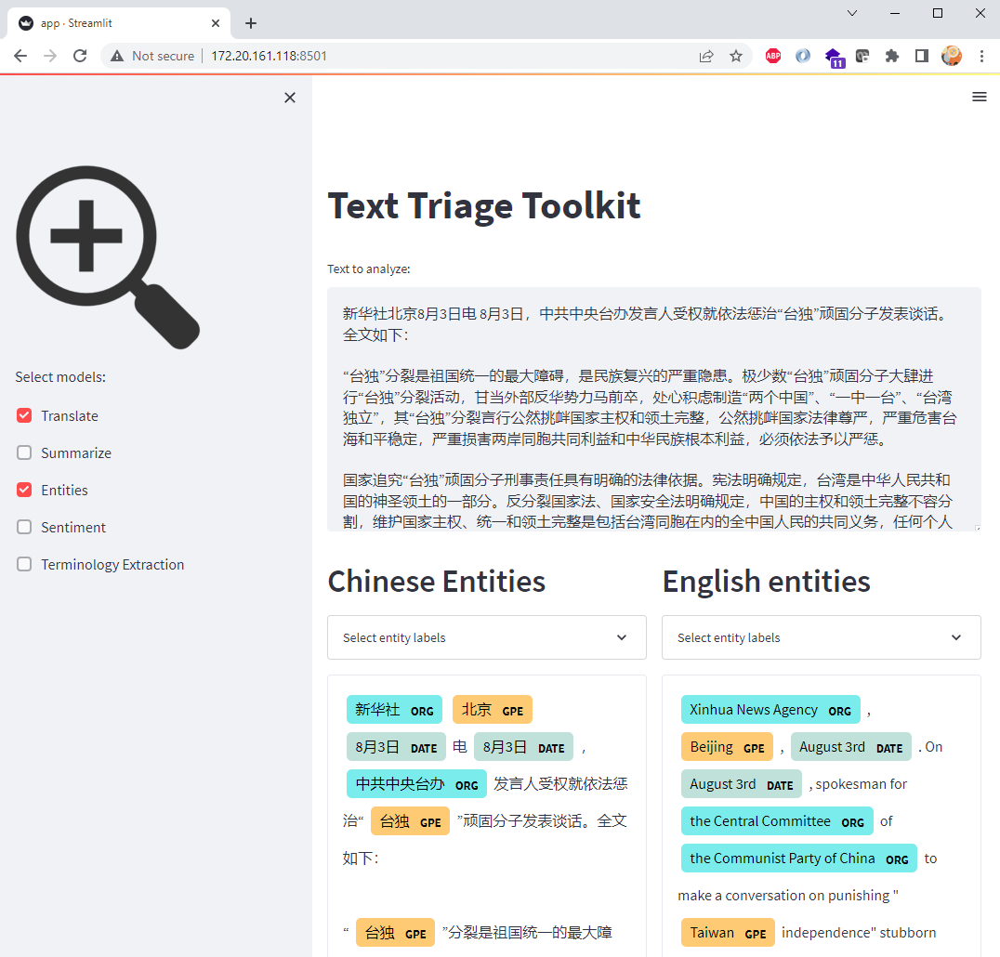
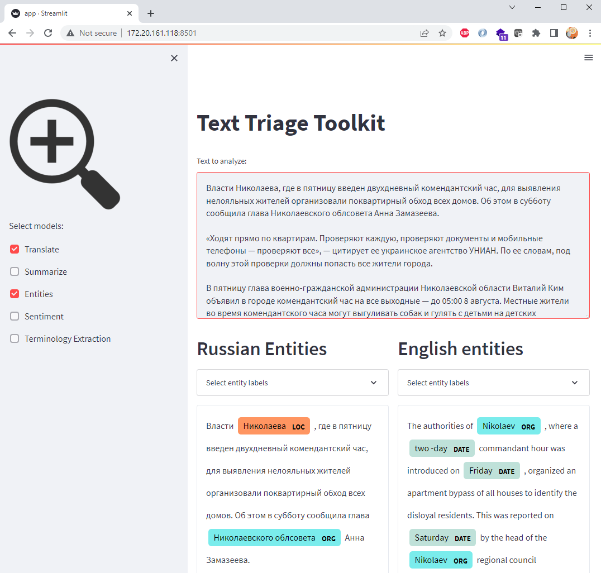
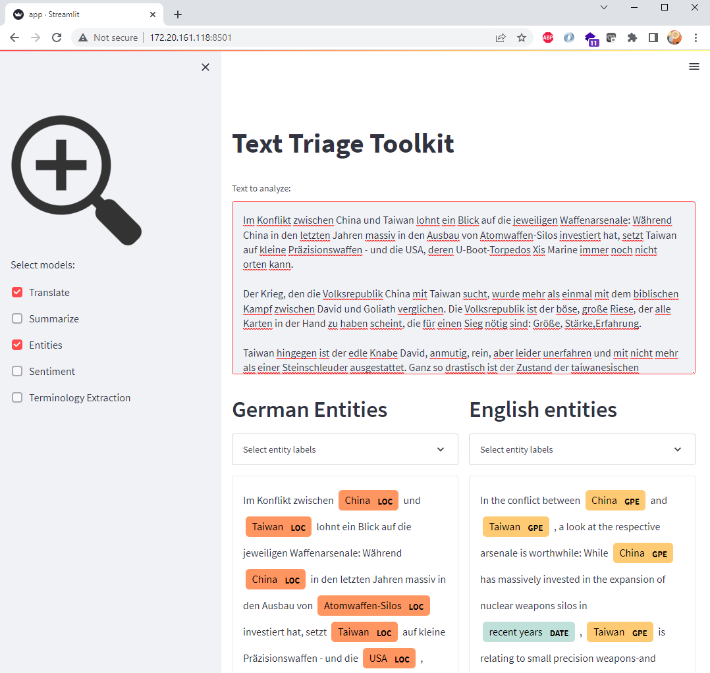

# Text Triage Toolkit 

Prototype of a user interface for various NLP models.  

For the given input text, the toolkit detects the input language and translates the text to English.  

It then applies the user-selected models (Summarize, Entities, Sentiment, etc.) to both the input text and the translated text.  

  

  

